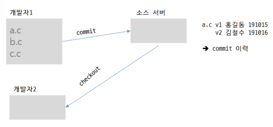

# version control system
- cvs
- svn
- git

## 기존 버전 관리 시스템 (svn)

1. 개발자가 소스서버에서 최신 소스코드 다운로드
   (checkout -> 서버에서 다운로드)
2. 개발자가 소스코드 수정, 개발
3. 개발자가 수정된 코드를 서버에 저장
   (commit -> 실제 서버에 전송)

## GIT

