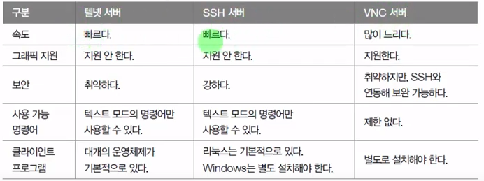
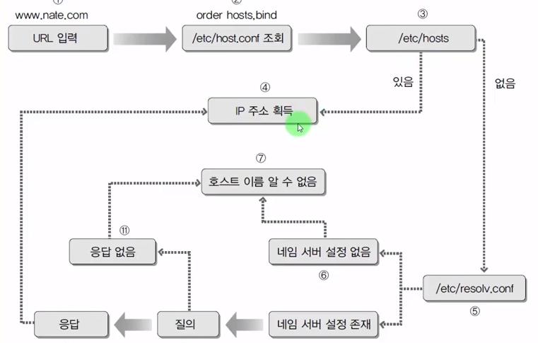
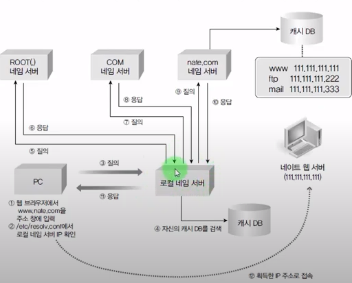

## 네트워크 관련 필수 개념

- TCP/IP
  - 컴퓨터 끼리 네트워크 상으로 의사소통을 하는 '프로토콜'중 가장 널리 사용된느 프로토콜의 한 종류
- 호스트 / 도메인
  - 호스트 : 각각의 컴퓨터에 지정된 이름
  - 도메인 : naver.com 과 같은 형식
- IP 주소
  - 각 컴퓨터의 랜카드에 부여되는 중복되지 않는 유일한 주소
  - 4바이트로 이루어져있으며 각 자리는 0~255 까지의 숫자
- 네트워크 주소
  - 같은 네트워크에 속해있는 공통된 주소
- 브로드캐스트 ㅜ소
  - 내부 네트워크의 모든 컴퓨터가 듣되게는 주소
  - 현재 주소의 제일 끝자리를 255로 바꾼 주소(c클래스)
- 게이트웨이, 라우터
  - 라우터 = 게이트웨이
  - 네트워크 간에 데이터를 전송하는 컴퓨터 또는 장지
- 넷마스크, 클래스
  - 네트워크 규모를 결정(255.255.255.0-c클래스)
- dns 서버 주소
  - url을 해당 컴퓨터의 ip주소로 변환해주는 서버
  - 설정 파일은 /etc/resolv.conf

## 네트워크 설정

- `/etc/network/interfaces` : 네트워크 기본정보가 설정된 파일
- `/etc/resolv.conf` : DNS 서버의 정보 및 호스트 이름
- `/etc/hosts` : 현 컴퓨터의 호스트 이름 및 FQDN이 들어있는 파일

- `nslookup` : 네트워크 연결 확인할수있음

## 파이프, 필터, 리디렉션

- 파이프
  - 두개의 프로그램을 연결해주는 연결통로의 의미
  - `|` 문자를 사용함 ex. `# ls -l /etc | more`
- 필터
  - 필요한 것만 걸러주는 명령어
  - `grep`, `tail`, `wc`, `sort`, `awk`, `sed` 등
  - 주로 파이프와 같이 사용
- 리디렉션
  - 표준 입출력의 방향을 바꿔줌
  - ex. `ls -l > list.txt`

## 프로세스, 데몬

- 정의 : 하드디스크에 저장된 실행코드가 메모리에 로딩되어 활성화된 것
- foreground process
  - 실행하면 화면에 나타나서 상호작용을 하는 프로세스
  - 대부분의 응용프로그램
- background process
  - 실행은 되었지만 화면에 나타나지 않고 실행되는 프로세스
  - 백신, 서버데몬 등
- 프로세스 번호 : 각각의 프로세스에 할당된 고유번호
- 작업 번호 : 현재 실행되고 있느 백그라운드 프로세스의 순차번호
- 모든 프로세스는 부모 프로세스를 가지고있음
- 부모 프로세스를 kill 하면 자식 프로세스도 자동으로 kill 됨
- `ps` : 현재 프로세스으 ㅣ상태를 확인하는 명령어 `ps -ef|grep <프로세스이름>`을 주로 사용
- `kill` : 프로세스를 강제종료하는 명령어 `kill -9 <프로세스 번호>`는 강제 종료
- `pstree` : 부모 프로세스와 자식 프로세스의 관계를 트리 형태로 보여줌

## 서비스와 소켓

- 서비스
  - 시스템과 독자적으로 구동되어 제공하는 프로세스
  - `systemctl start/stop/restart 서비스이름` 으로 사용된다.
  - `/lib/systemd/system/서비스이름.service` 서비스의 실행 스크립트 파일

## 응급복구

- 시스템이 부팅이 되지 않을 경우에 수행
- GRUB 편집
- init = /bin/bash 로 접속

## 모듈의 개념과 커널 컴파일의 필요성

## SATA 장치와 SCSI 장치의 구성

[파일 시스템의 종류 참고 링크](https://aroundck.tistory.com/774)

- `fdisk` : 물리 디스크에 논리 파티션을 생성하는데 사용
- `mkfs` : 파티션에 파일 시스템을 만들어준다.
- `mount` : 파일시스템을 지정한 디렉토리에 연결해서 사용 가능하도록 한다
- `/etc/fstab` : 파일 시스템 정보를 저장하고있는 파일, 마운트 정보를 가지구있다

## RAID 정의 및 개념

- RAID 정의
  - Redundant Array of Inexpensive Disks
  - 여러 개의 디스크를 하나의 디스크처럼 사용함
  - 비용 절감 + 신뢰성 향상 + 성능 향상

## 셸 스크립트 프로그래밍

### 정규 표현식

TODO
| 메타 문자 | 기능 | 사용 예 | 사용 예 설명 |
| :-------- | :----------------- | :------- | :-------------------------------------------------------------- |
| ^ | 행의 시작 | /^love/ | love로 시작하는 모든 행과 대응 |
| \$ | 행의 끝 | /love\$/ | love로 끝나는 모든 행과 대응 |
| . | 하나의 문자와 대응 | /l..e/ | l 다음에 두글자가 나오고 e로 끝나는 문자열을 포함하는 행과 대응 |
| \* | 하나의 문자와 대응 | /l..e/ | l 다음에 두글자가 나오고 e로 끝나는 문자열을 포함하는 행과 대응 |

### 환경 변수

| 환경 변수    | 설명                           |
| :----------- | :----------------------------- |
| HOME         | 현재 사용자의 홈 디렉터리      |
| PATH         | 실행 파일을 찾는 디렉터리 경로 |
| LANG         | 기본 지원되는 언어             |
| PWD          | 사용자의 현재 작업 디렉터리    |
| TERM         | 로그인 터미널 타임             |
| SHELL        | 로그인해서 사용하는 셸         |
| USER         | 현재 사용자 이름               |
| DISPLAY      | X 디스플레이 이름              |
| COLUMNS      | 현재 터미널의 컬럼수           |
| LINES        | 현재 터미널 라인 수            |
| PS1          | 1차 명령 프롬프트 변수         |
| PS2          | 2차 명령 프롬프트(대개는 '>')  |
| BASH         | bash 셸의 경로                 |
| BASH_VERSION | bash 버전                      |
| HISTFILE     | 히스토리 파일의 경로           |
| HISTSIZE     | 히스토리 파일에 저장되는 개수  |
| HOSTNAME     | 호스트의 이름                  |
| USERNAME     | 현재 사용자 이름               |
| LOGNAME      | 로그인 이름 름                 |
| LS_COLORS    | ls 명령의 확장자 색상 옵션     |
| MAIL         | 메일을 보관하는 경로           |
| OSTYPE       | 운영체제 타입                  |

### 조건문

- 문자열 비교
  - `"문자열1" = "문자열2"`
  - `"문자열1" != "문자열2"`
  - `-n "문자열"` : 문자열이 NULL이 아니면 true
  - `-z "문자열"` : 문자열이 NULL 이면 true
- 산술 비교
  - `수식1 -eq 수식2` : equal
  - `수식1 -ne 수식2` : not equal
  - `수식1 -gt 수식2` : grater than
  - `수식1 -ge 수식2` : grater equal
  - `수식1 -lt 수식2` : less than
  - `수식1 -le 수식2` : less equal
  - `!수식` : not
- 파일 조건
  - `-d 파일이름` : 파일이 디렉토리이면 참 (directory)
  - `-e 파일이름` : 파일이 존재하면 참 (exist)
  - `-f 파일이름` : 파일이 일반 파일이면 참 (file)
  - `-g 파일이름` : 파일이 set-group-id가 설정되면 참(group)
  - `-r 파일이름` : 파일이 읽기 가능이면 참 (read)
  - `-s 파일이름` : 파일 크기가 0이 아니면 참 (size)
  - `-u 파일이름` : 파일에 set-user-id가 설정되면 참 (user)
  - `-w 파일이름` : 파일이 쓰기 가능 상태이면 참(write)
  - `-x 파일이름` : 파일이 실행 가능 상태이면 참(excute)
- 관계 연산자
  - `-a` 또는 `&&`
  - `-o` 또는 `||`

## 원격지 시스템 관리하기

`/etc/securetty` 파일때문에 외부에서 root로 접속할 수 없음

## OpenSSH 서버 구축

- 원격지에서 보안이 강화된 서버 접속할 경우 필요
- OpenSSh 서버 설치 과정
  1. ssh 서버 설치 / 가동
     1. `apt-get install openssh-server`
     2. `systemctl restart ssh`
     3. `systemctl enable ssh` : 시스템을 상시 사용한다.
  2. 방화벽 설정
     1. `ufw allow 22/tcp`
- VNC 서버 (참고)
  - X 윈도우 접속이 가능하다.
  - vncviewer

## 네임서버

- DNS(Domain Name System) 서버
- 도메인 이름을 IP 주소로 변환시켜주는 역할 = Name Resolution
  - ex. www.naver.com -> 120.50.131.112
- `nslookup` 으로 아이피 주소를 확인할 수있음

1. 가장 초기의 네트워크 접속방법
   - 컴퓨터가 몇대 안 됨
   - 사용자가 모두 외워서 직접 IP 주소로 접근함
2. hosts 파일을 이용하여 네트워크 접속
   - 인터넷에 연결된 컴퓨터가 수십~수백대로 늘어남
   - 'hosts' 파일에 URL과 IP주소를 지록해 놓는 방식 사용
     - `102.54.94.97 rhino.acme.com` `::1 localhost` `127.0.0.1 localhost`
     - window : `c:\windows\system32\drivers\etc\hosts`
     - linux : `/etc/hosts`
3. 네임 서버를 이용하여 네트워크접속
   - 기하급수적으로 늘어나는 네트워크상의 컴퓨터에 대한 모든 IP정보를 파일하나에 기록하는것은 무리
   - 이름해석(Name Resolution)을 전문적으로 해 주는 서버 컴퓨터가 필요해짐 (DNS 서버)
   - 전화 안내 서비스인 114와 같은 역할
   - 네임서버는 인터넷에서 변화하는 모든 컴퓨터의 URL과 IP정보를 실시간으로 제공
   - URL만 알고있으면 어디서든지 해당하는 컴퓨터에 접속

## 도메인 이름 체계

- 트리 구조와 같다
- 로컬 네임서버의 작동 순서
  - 

[네임서버 구축관련 링크](https://youtu.be/LuGhDqeLTt8)

## DBMS 개념
- `explain 테이블 이름` : 테이블 구조 조회