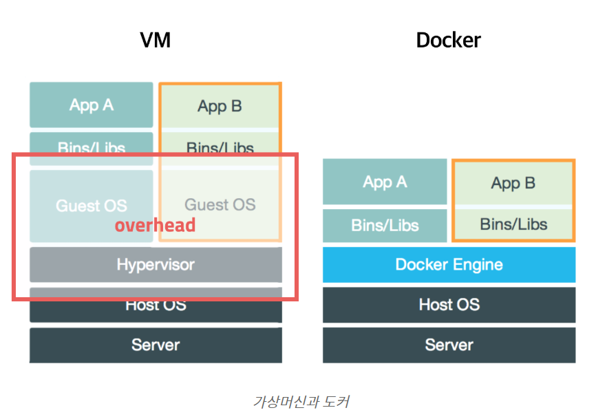
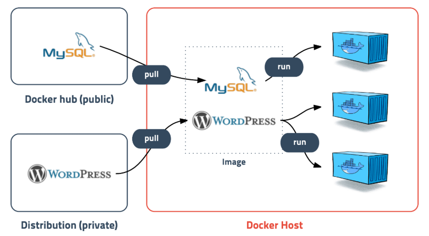
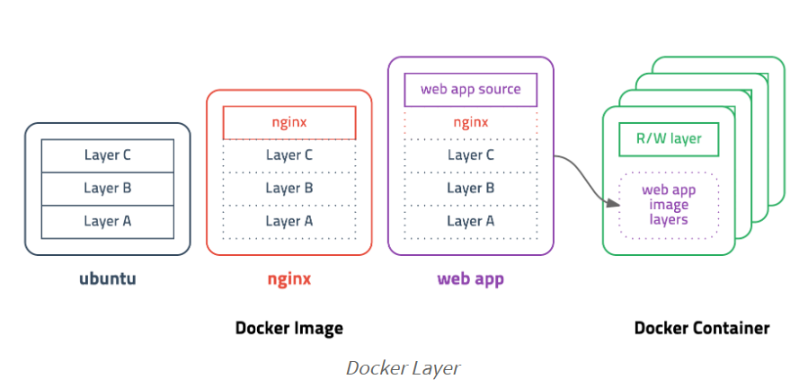
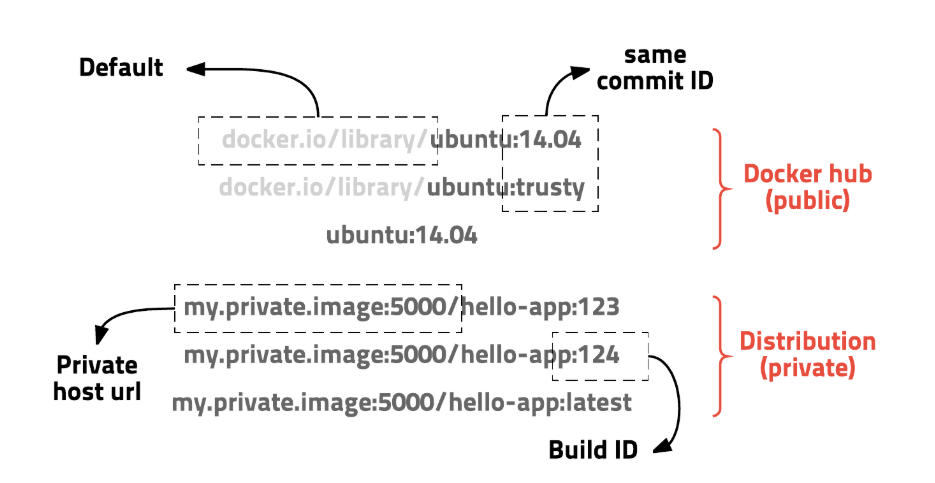

# Docker

`강조`

```javascript
code 삽입
```

_예제_

## 1.1 Docker 란?

- 컨테이너 기반의 오픈소스 가상화 플랫폼

### 1.1.2 컨테이너

```
프로그램, 실행환경 -> 박스에 담는느낌 (추상화)
프로그램의 배포 or 관리를 단순하게 해줌
어디서든 실행 가능
```

### 1.1.3 os 가상화

```
VMware, VircualBox -> 여러 os를 가상화 할 수있고 사용이 간단하지만 무겁고 느린 단점이있음
개선 : cpu의 가상화 기술(HVM)을 이용한 KVM과 반가상화 방식의 Xen이 등장 (**검색 해보기**)
```

가상머신과 도커

```
하지만 추가적인 OS를 설치하여 가상화 하는방법은 어쨌든 성능문제가 존재
--> 프로세스를 격리하는 방식(리눅스 컨테이너)이 등장
```

### 1.1.4 리눅스 컨테이너

1. 하나의 서버에 여러개의 컨테이너 -> 독립적으로 실행
2. `apt-get` 이나 `yum`으로 패키지 설치 가능
3. 여러개의 프로세스를 백그라운드로 실행
4. cpu나 메모리의 사용량을 제한 할 수있음
5. 호스트의 특정 포트와 연결하거나 호스트의 특정 디렉토리를 내부디렉토리처럼 사용가능
6. 새로운 컨테이너를 만드는데 걸리는시간은 겨우 1-2초

## 1.2 도커 이미지

도커 이미지

```
컨테이너 실행에 필요한 파일과 설정값등을 포함하고 있는 것
상태값을 가지지 않고 변하지 않음(immutable)

컨테이너는 이미지를 실행한 상태
추가/변경되는 값은 컨테이너에 저장

같은 이미지에서 여러개의 컨테이너 생성가능
컨테이너의 상태가 변경/삭제 되더라도 이미지는 남아있음

이미지는 컨테이너를 실행하기 위한 모든 정보를 가지고있음
-> 의존성 파일을 컴파일하고 설치할 필요가 없게된다.

새로운 서버가 추가되면
미리 만들어 놓은 이미지를 다운받고
컨테이너를 생성만 하면된다.
```

_예를 들면 ubuntu 이미지는 ubuntu를 실행하기 위한 모든 파일을 가지고있다_
_Gitlab 이미지는 centos를 기반으로 ruby, go, database, redis, gitlac source, nginx등을 가지고 있다_

- 참고
  - [Docker hub]("https://hub.docker.com/")
  - [Docker Registry]("https://docs.docker.com/registry/")

### 1.2.1 도커 레이어

도커 레이어

```
도커 이미지는 모든 정보를 가지고있다
-> 보통 용량이 수백메가(MB)

처음에 이미지를 다운받을땐 괜찮지만
기존 이미지에 파일 하나 추가했을 경우에는 ?

이를 해결하기 위해서 레이어라는 개념을 사용한다.
컨테이너를 생성할 때도 레이어 방식을 사용
기존의 이미지 레이어 위에 읽기/쓰기 레이어를 추가해줌
-> 컨테이너 실행중 생성/변경된 내용은 읽기/쓰기 레이어에 저장되므로 여러개의 컨테이너를 생성해도 최소한의 용량만 사용한다.
```

- 이미지는 여러개의 read only 레이어로 구성
- 파일이 추가/수정 되면 새로운 레이어가 생성

**example**

- ubuntu 이미지 = a + b + c
- ubuntu + nginx = a + b + c + ngix
- ubuntu + nginx + webapp = a + b + c + ngix + source
- ubuntu + nginx + webapp(수정) = a + b + c + ngix + source(v2)

## 1.2.2 도커 이미지 URL

도커 레이어

```
이미지는 url 방식으로 관리하며 태그를 붙일 수 있다.
```

- ubuntu 14.04 이미지는 `docker.io/library/ubuntu:14.04` 또는 `docker.io/library/ubuntu:trusty` 이고 `docker.io/library`는 생략가능 `ubuntu:14.04`로 사용할 수있다.


## 1.3 도커를 써야하는 이유

```
눈송이 서버
 똑같은 일을 하는 두 서버가 있다 해도, 
 A 서버는 한 달 전에 구성했고 B 서버는 이제 막 구성했다면,
 운영체제부터 컴파일러, 설치된 패키지까지 완벽하게 같기는 쉽지 않습니다. 
 그리고 이러한 차이점들이 장애를 일으키고 말죠. 
 A 서버는 잘 되는데 B 서버는 왜 죽었지?와 같은 일(혹은 그 반대)이 벌어지는 겁니다.
```
### 1.3.1 도커 파일
- 서버 운영 기록을 코드화 한 것

### 1.3.2 도커 이미지
- 도커 파일 + 운영기록을 실행할 시점
- 서버가 구성되는 시점이 이미지를 만든 시점으로 고정

===> 컨테이너에 같은 이미지들을 관리 할 수있다.

# 2 실습


## 2.1 설치 

```linux
curl -fsSl https://get.docker.com/ | sudo sh
```

docker는 기본적으로 루트권한이 필요하다.
sudo 없이 사용하려면 `docker` 그룹에 추가한다.

```linux
sudo usermod -aG docker $USER`  # 현재 사용자에게 권한부여
sudo usermod -aG docker your-user` your-user  # 사용자에게 권한 부여
```

