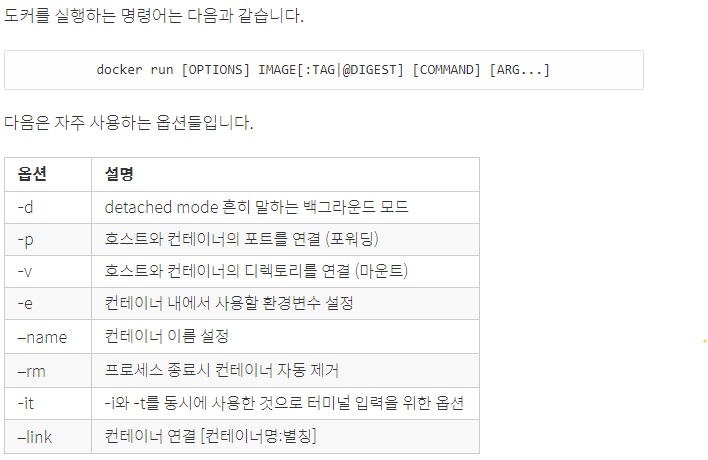

## 1. 명령어
```sudo docker <명령어>```
##### 1.1 search 
docker hub 에서 이미지를 검색할 수 있음
##### 1.2 pull 
docker image를 받는다 
```linux
$ sudo docker pull <이미지 이름>:<태그 [latest : 최신 버전]> 
```
##### 1.3 images
받은 image의 목록을출력
```linux
$ sudo docker images <이미지 이름?>
```
##### 1.4 run
이미지를 컨테이너로 생성한 뒤 실행
```linux
$ sudo docker images <이미지 이름?>
```


[실행 옵션 더보기](./docker_run_option.md)

##### 1.5 ps
모든 컨테이너 목록을 출력
```linux
$ sudo docker ps
```

##### 1.6 start
컨테이너 시작

```linux
$ sudo docker start <컨테이너 이름 | 컨테이너 아이디>

$ sudo docker restart <컨테이너 이름 | 컨테이너 아이디> 
재부팅
```

##### 1.7 attach
컨테이너 접속
```linux
$ sudo docker attach <컨테이너 이름 | 컨테이너 아이디>

쉘에서 빠져나올 때
- 정지
$ exit
ctrl d

- 정지하지않고 빠져나오기
ctrl p + ctrl q
```
##### 1.8 exec
외부에서 컨테이너로 명령 사용하기
```linux
$ sudo docker exec <컨테이너 이름 | 아이디> <명령>

ex)
$ sudo docker exec hello echo "Hello World"
```
##### 1.9 stop
컨테이너 정지

```linux
$ sudo docker stop <컨테이너 이름 | 아이디>
```
##### 1.10 rm
컨테이너 삭제

```linux
$ sudo docker rm <컨테이너 이름 | 아이디>
```
##### 1.11 rmi
이미지 삭제

```linux
$ sudo docker rm <이미지 이름>:<태그>
```
##### 1.12 history
이미지 히스토리 조회

```linux
$ sudo docker history <이미지 이름>:<태그>
```
##### 1.13 cp
컨테이너에서 파일 꺼내기

```linux
$ sudo docker cp <컨테이너 이름>:<경로> <호스트 경로>
```
##### 1.14 commit
컨테이너의 변경 사항을 이미지 파일로 생성

```linux
$ sudo docker commit <옵션> <컨테이너 이름> <이미지이름>:<태그>

ex)
$ sudo docker commit -a "Foo Bar <foo@bar.com>" -m "add hello.txt" hello-nginx hello:0.2
```
##### 1.15 diff
컨테이너가 실행되면서 변경된 파일 목록

```linux
$ sudo docker diff < 컨테이너 이름 | 아이디 >

A : add
C : change
D : delete
```
##### 1.16 inspect
이미지와 컨테이너의 세부정보를 출력

```linux
$ sudo docker inspect < 이미지 | 컨테이너이름 | 아이디 >
```
##### 1.17 build
Dockerfile로 이미지를 생성하는 명령
Dockerfile 경로는 로컬 / URL 을 사용, 
```
$ docker build <옵션> <Dockerfile 경로>

--force-rm=false: 이미지 생성에 실패했을 때도 임시 컨테이너를 삭제합니다.
--no-cache=false: 이전 빌드에서 생성된 캐시를 사용하지 않습니다. 
                  Docker는 이미지 생성 시간을 줄이기 위해서 Dockerfile의 각 과정을 캐시하는데,
                  이 캐시를 사용하지 않고 처음부터 다시 이미지를 생성합니다.
-q, --quiet=false: Dockerfile의 RUN이 실행한 출력 결과를 표시하지 않습니다.
--rm=true: 이미지 생성에 성공했을 때 임시 컨테이너를 삭제합니다.
-t, --tag=””: 저장소 이름, 이미지 이름, 태그를 설정합니다. 
              <저장소 이름>/<이미지 이름>:<태그> 형식입니다.


ex)
docker build -t test_api:0.1 .
$ sudo docker build -t test_api:0.1 /opt/hello
$ sudo docker build -t test_api:0.1 ../../


$ sudo docker build -t test_api:0.1 https://raw.githubusercontent.com/kstaken/dockerfile-examples/master/apache/Dockerfile


$ echo -e "FROM ubuntu:14.04\nRUN apt-get update" | sudo docker build -t hello -
$ cat Dockerfile | sudo docker build -t hello -
$ sudo docker build -t hello - < Dockerfile
```