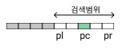

# 검색 알고리즘

## 3-2 선형 검색

### 선형 검색 (linear search)

- 원하는 값을 찾을 때까지 맨 앞부터 스캔하여 순서대로 검색하는 알고리즘
- 종료조건 2가지 (값을 찾았을때, 끝까지 탐색한 경우)
- 배열 원소 개수가 n일때 판단하는 횟수는 평균 n/2

#### 보초법 (sentinel method)

- 검색하고자 하는 키값을 배열의 맨 끝에 저장
- 선형 검색의 종료조건 중 끝까지 탐색하는 경우는 판단할 필요가 없음

## 3-3 이진 검색

### 이진 검색 (binary search)

- 오름차순 또는 내림차순으로 정렬된 배열에서 효율적
- 중앙에 위치한 원소를 기준으로 탐색
- 종료조건
  1. a[pc]와 key가 일치하는 경우
  2. 검색 범위가 더 이상 없는 경우
- 검색하는데 필요한 비교횟수는 평균 logn, 검색 실패시 log(n+1)번, 검색 성공시 log(n-1)번

### 복잡도 (complexity)
1. 시간 복잡도 (time complexity)
   - 실행하는데 필요한 시간
2. 공간 복잡도 (space complexity)
   - 메모리와 파일공간이 얼마나 필요한지
- 1번만 실행되는 경우 복잡도 O(1)
- n에 비례하는 횟수만큼 실행되는 경우 복잡도 O(n)
- O(f(n)) + O(g(n)) = O(max(f(n), g(n)))
- ex) O(1) + O(n) + O(n) + O(1) + O(n) = O(max(1,n,n,1,n)) = O(n)

## 3-4 해시법

### 해시법 (hashing)
- '데이터를 저장할 위치 = 인덱스'를 간단한 연산으로 구하는 것
- 원소의 검색뿐 아니라 추가, 삭제도 효율적으로 수행할 수 있음
- 해시함수: 키를 해시값으로 변환하는 과정
- 체인법: 해시값이 같은 원소를 연결 리스트로 관리
- 오픈주소법: 빈 버킷을 찾을 때까지 해시를 반복

#### 체인법 (chaining)
- 오픈 해시법 (open hashing)
- 해시값이 같은 데이터를 연결 리스트로 연결하는 방법